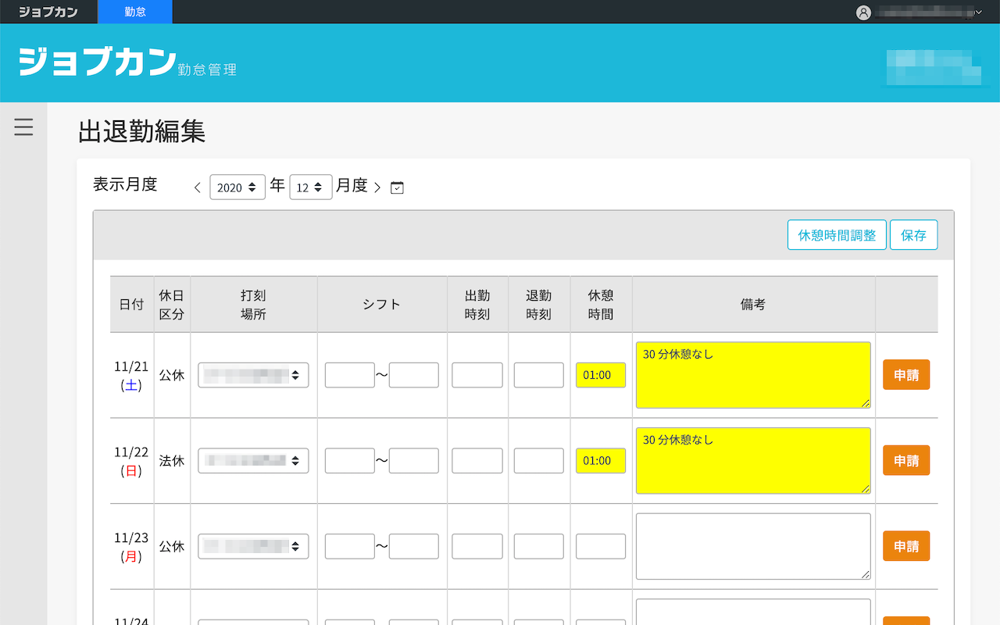

# ジョブカン調整

ジョブカンの休憩時間を `01:00` で調整する拡張です :calendar:
フォームを書き換えるだけなので、申請ボタンは別途押す必要があります。

[こちら](https://chrome.google.com/webstore/detail/jobcan-adjustor/dgnkjejmcjifeeipiomjkfbmclneoppo) からダウンロードできます :pray:

